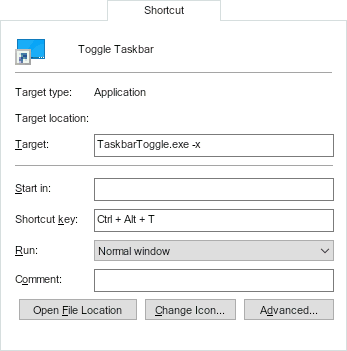

# ToggleTaskbar
Toggles the "Automatically hide the taskbar" setting and optionally hides it completely.

## Usage
- build or download [TaskbarToggle.exe](../../releases/download/v1.1/TaskbarToggle.exe)
- create a shortcut in your start menu and give it a Shortcut key, e.g.:
- 